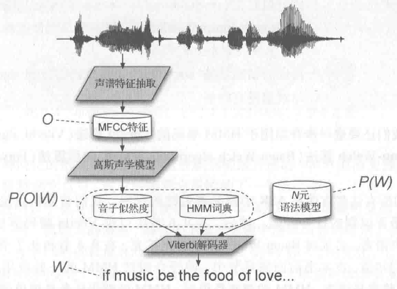

语音识别基本概念
================

对于 `语音识别` 不严谨的理解：

在中文上，一个字的发音由 `声母` 和 `韵母` 决定（还有声调），将  `声母` 和 `韵母` 统称为 `音素(phones)` 。

语音是一串序列，将序列分帧（每帧一般25毫秒），然后由帧识映射到 `音素` ，再组成字，最后组成一句话。

而在英文上，是由 `音素` 组成 `音节` 再组成 `字` 。

::

    wave -> phones -> word -> sentence
    语音 -> 音素   -> 字   -> 句子

- `wave -> phones` ：计算每帧语音的MFCC特征，根据声学模型(Acoustic Model)估计每帧语音对应的 `音素` ；
- `phones -> word` ：通过发音词典(Lexicon)确定 `音素` 对应的 `字` （通过发音词典设置 `字` 的搜索空间）；
- `wrod -> sentence` ：通过语言模型(Language Model)确定 `字` 最可能组成的 `句子` （通过语料库设置 `句子` 的概率搜索空间）。

对于给定的声学输入 :math:`O` ，在语言 :math:`L` 的所有句子 :math:`W` 中，我们要计算最可能的句子:

..  math::
    \hat{W} = \underset{W \in L}{argmax} P(W|O)

