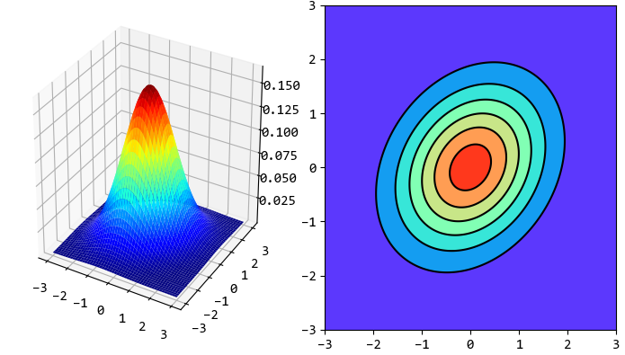
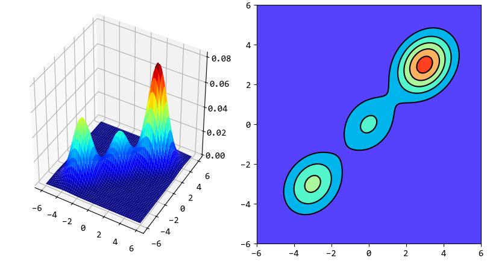

GMM
===

高斯概率密度函数（Gaussian Mixtrue Model, GMM）用于声学似然度的计算，即计算出MFCC特征后，怎么找到其对应的音素。

- 单变量高斯分布：

..  math::
    f(x | \mu, \sigma) &= \frac{1}{\sqrt{2 \pi \sigma^2}}
                          exp \left( - \frac{(x-\mu)^2}{2\sigma^2} \right) \\
    均值 &= \mu \\
    方差 &= \sigma^2

- 多变量高斯分布：

..  math::
    f(x | \mu, \Sigma) = \frac{1}{(2\pi)^{D/2} |\Sigma|^{1/2}}
                          exp \left( - \frac{1}{2} (x-\mu)^T \Sigma^{-1} (x-\mu) \right)

- 混合高斯分模型：

把若干个多变量高斯分布加权混合，称为混合高斯模型。

..  math::
    f(x | \mu, \Sigma) &= \sum_{k=1}^{M}
                          c_k
                          \frac{1}{\sqrt{2 \pi |\Sigma|}}
                          exp \left[(x-\mu_k)^T \Sigma^{-1} (x-\mu_k) \right]\\
                       &= \sum_{k=1}^{M}
                          c_k f_k(x | \mu_k, \Sigma_k)

