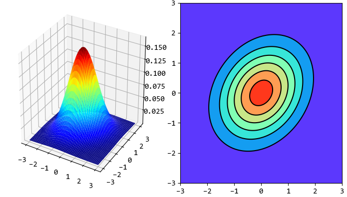
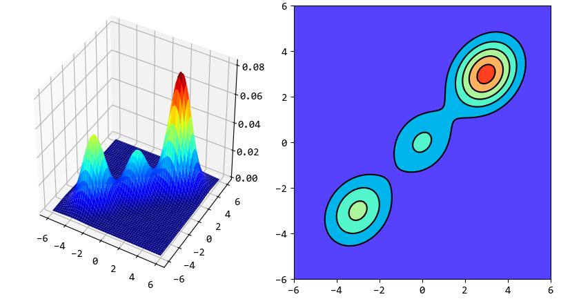

GMMHMM
======

混合高斯分模型(Gaussian Mixtrue Model, GMM)的概率密度函数(probability density function, pdf)用于声学似然度的计算，即计算出MFCC特征后，怎么找到其对应的音素。

单变量高斯分布
--------------

..  math::
    f(x | \mu, \sigma) &= \frac{1}{\sqrt{2 \pi \sigma^2}}
                          exp \left( - \frac{(x-\mu)^2}{2\sigma^2} \right) \\
    均值 &= \mu \\
    方差 &= \sigma^2

将HMM的观测似然度函数 :math:`b_j(o_t)` 表示为高斯概率密度函数，则有：

..  math::
    b_j(o_t) &= f(o_t | \mu_j, \sigma_j) \\[2ex]
    \hat{\mu}_i &= \frac{\sum_{t=1}^{T} \xi_t(i)o_t}
                        {\sum_{t=1}^{T} \xi_t(i)} \\[2ex]
    \hat{\sigma}_i^2 &= \frac{\sum_{t=1}^{T} \xi_t(i) (o_t-\mu_i)^2}
                             {\sum_{t=1}^{T} \xi_t(i)}

多变量高斯分布
--------------

..  math::
    f(x | \mu, \Sigma) &= \frac{1}{(2\pi)^{D/2} |\Sigma|^{1/2}}
                          exp \left( - \frac{1}{2} (x-\mu)^T \Sigma^{-1} (x-\mu) \right) \\
    均值矢量 &= \mu \\
    协方差矩阵 &= \Sigma

声间典型的MFCC特征矢量的维度 :math:`D=39` ，则对于给定的MFCC观测矢量 :math:`o_t` ，观测似然度函数为：

..  math::
    b_j(o_t) &=  f(o_t | \mu_j, \Sigma_j) \\[2ex]
    \hat{\mu}_i &= \frac{\sum_{t=1}^{T} \xi_t(i)o_t}
                        {\sum_{t=1}^{T} \xi_t(i)} \\[2ex]
    \hat{\sigma}_i^2 &= \frac{\sum_{t=1}^{T} \xi_t(i) (o_t-\mu_i)(o_t-\mu_i)^T}
                             {\sum_{t=1}^{T} \xi_t(i)}

混合高斯分模型
--------------

把若干个多变量高斯分布加权混合，称为混合高斯模型。

..  math::
    f(x | \mu, \Sigma) &= \sum_{k=1}^{M}
                          w_k
                          \frac{1}{\sqrt{2 \pi |\Sigma|}}
                          exp \left[(x-\mu_k)^T \Sigma^{-1} (x-\mu_k) \right]\\
                       &= \sum_{k=1}^{M}
                          w_k f_k(x | \mu_k, \Sigma_k)

观测似然度函数为：

..  math::
    b_j(o_t) = \sum_{m=1}^{M}
               w_{jm} f_m(o_t | \mu_{jm}, \Sigma_{jm})

对于每一个状态 :math:`j` ，其生成观测 :math:`o_t` 的概率，均需要 :math:`M` 个权重、均值矢量、协方差矩阵来计算。

输出 :math:`o_t` 的第 :math:`m` 个混合分量在时刻 :math:`t` 状态为 :math:`j` 的概率为：

..  math::
    \xi_{tm}(j) = \frac{\alpha_t(j) \beta_t(j) w_{jm} b_{jm}(o_t)}
                       {\sum_{i=1}^N \alpha_t(i) \beta_t(i) \sum_{m=1}^M w_{jm} b_{jm}(o_t) }

更新混合权重、均值和协方差矩阵：

..  math::
    \hat{w}_{im} &= \frac{\sum_{t=1}^T \xi_{tm}(i)}
                         {\sum_{t=1}^T \sum_{m=1}^M \xi_{tm}(i)} \\[2ex]
    \hat{\mu}_{im} &= \frac{\sum_{t=1}^T \xi_{tm}(i) o_t}
                          {\sum_{t=1}^T \xi_{tm}(i)} \\[2ex]
    \hat{\Sigma}_{im} &= \frac{\sum_{t=1}^T \xi_{tm}(i)(o_t - \mu_{im})(o_t - \mu_{im})^T}
                              {\sum_{t=1}^T \xi_{tm}(i)}

