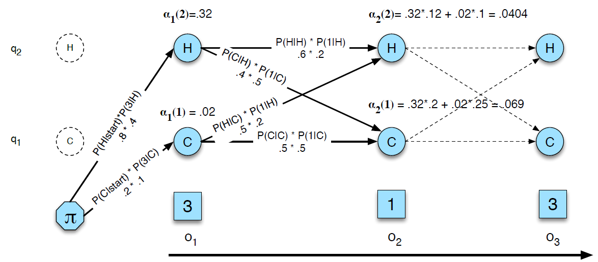
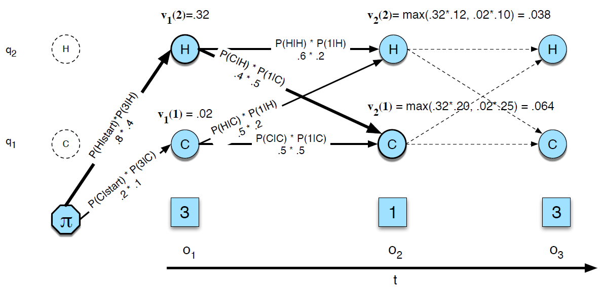

HMM
===

隐马尔可夫模型（Hidden Markov Model, HMM）形式化定义：

:math:`Q=q_1 q_2 ... q_N` ： 状态 :math:`N` 的集合

:math:`A={a_{ij}}` ：转移概率矩阵，表示从状态 :math:`i` 转移到状态 :math:`j` 的概率

:math:`O=o_1 o_2 ... o_T` ： 观察 :math:`T` 的序列

:math:`B=b_i(o_t)` ： 观察似然度序列，也称发射概率，表示从状态 :math:`i` 生成观察 :math:`o_t` 的概率

:基本问题:

#. 似然度问题：给定HMM :math:`\lambda = (A, B)` 和一个观察序列 :math:`O` ，计算似然度 :math:`P(O|\lambda)`
#. 解码问题：给定HMM :math:`\lambda = (A, B)` 和一个观察序列 :math:`O` ，找到最可能的隐藏状态序列 :math:`Q`
#. 学习问题：给定HMM中的状态集合和一个观察序列 :math:`O` ，训练HMM的参数 :math:`\lambda = (A, B)`

向前算法（Forward algorithm）
-----------------------------

向前算法用于似然度问题。

考虑HMM有状态有 :math:`N` 个，序列长度为 :math:`T` ，则可能的状态序列有 :math:`N^T` 种，则观察序列 :math:`O` 的似然度等于在所有可能状态序列下出现 :math:`O` 的概率之和：

..  math::
    P(O) = \sum_Q P(O|Q)P(Q)

向前算法本质是动态规化，产生观测序列 :math:`o_1, o_2, ... o_t` 且 :math:`t` 时刻状态为 :math:`j` 的概率为：

..  math::
    \alpha_t(j) = P(o_1, o_2, ... o_t, q_t = j | \lambda)

递归求解：

..  math::
    \alpha_t(j) = \sum_{i=1}^{N} \alpha_{t-1}(i) a_{ij} b_j(o_t)

向前网络示意图：

向后算法（Backward algorithm）
------------------------------

向后算法同样用于计算似然度问题，与Forward算法类似，只是从后面算起。

递归式如下：

..  math::
    \beta_t(i) = \sum_{j=1}^{N} \beta_{t+1}(j) a_{ij} b_j(o_{t+1})

维特比算法（Viterbi algorithm）
-------------------------------

Viterbi算法用于解码问题。

考虑HMM有状态有 :math:`N` 个，序列长度为 :math:`T` ，则可能的状态序列有 :math:`N^T` 种，解码即要在 :math:`N^T` 种状态序列中，找出能够最大概率产生观察序列 :math:`O` 的 `最佳状态序列` :math:`Q=q_1 q_2 ... q_T` 。

Viterbi可以递归求解（与Forward类似，只是这里是取最值），
产生观测序列 :math:`o_1, o_2, ... o_t` 且 :math:`t` 时刻状态为 :math:`j` 的最大概率为：

..  math::
    v_t(j) = \underset{i=1}{\overset{N}{max}} \lbrace v_{t-1}(i) a_{ij} b_j(o_t) \rbrace

当计算到 :math:`v_t` 时，可以知道对应的状态 :math:`argmax(v_t)` ， 为了求解 `最佳状态序列` 的路径，需要保存每一次递归的状态用于反向追踪：

..  math::
    bt_t(j) = \underset{i=1}{\overset{N}{argmax}} \lbrace v_{t-1}(i) a_{ij} b_j(o_t) \rbrace

Viterbi网络示意图：

Baum-Welch算法
--------------

..  向前向后算法（Forward-backward algorithm）

Baum-Welch算法，用于学习训练问题。

- 若训练样本中每个观察序列 :math:`O` 对应的状态序列已知，则可以通过频数统计计算：

..  math::
    a_{ij} &= \frac{C(i \to j)}{\sum_{q \in Q} C(i \to q)} \\
    b_i(o_t) &= \frac{C(i, o_t)}{\sum_{o \in O} C(i, o)}

- 训练样本中每个观测序列 :math:`O` 只有观测值，没有状态值。

:E-Step:

..  math::
    \gamma_t(i) &= \frac{\alpha_t(i) \beta_t(i)}
                        {\sum_{i=1}^N \sum_{j=1}^N \alpha_t(i) a_{ij} b_j(o_{t+1}) \beta_{t+1}(j)} \\[2ex]
    \xi_t(i, j) &= \frac{\alpha_t(i) a_{ij} b_j(o_{t+1}) \beta_{t+1}(j)}
                        {\sum_{i=1}^N \sum_{j=1}^N \alpha_t(i) a_{ij} b_j(o_{t+1}) \beta_{t+1}(j)}

:M-Step:

..  math::
    \hat{a}_{ij} &= \frac{\sum_{t=1}^{T-1} \xi_t(i, j)}
                         {\sum_{t=1}^{T-1} \gamma_t(i)} \\[2ex]
    \hat{b}_{j}(v_k) &= \frac{\sum_{t=1, s.t. o_t = v_k}^{T} \gamma_t(j)}
                             {\sum_{t=1}^{T} \gamma_t(j)} \\[2ex]
    \pi_i &= \gamma_1(i)

:参考:

- `Speech and Language Processing <https://web.stanford.edu/~jurafsky/slp3>`_
- `理解隐马尔可夫模型 <https://mp.weixin.qq.com/s?__biz=MzU4MjQ3MDkwNA==&mid=2247488854&idx=1&sn=32ccaf393b12bb30f0ea4f7f8c08e65d&chksm=fdb688c1cac101d7729763b08da86c0925b1db7e1f61f055fa65f2eeb49fb51bd0f58450a61b&mpshare=1&scene=1&srcid=0213gzkkKvTS3xTbmSfI5qFT&pass_ticket=SFUfBHoxTFgFsbJV0bNyWPGKlh9%2Fzw%2BhCVd6mn8nEHX%2BoYNkgKE3bixjNylCG%2FFY#rd>`_
- `HMM学习最佳范例全文PDF文档及相关文章索引 <http://www.52nlp.cn/hmm%e5%ad%a6%e4%b9%a0%e6%9c%80%e4%bd%b3%e8%8c%83%e4%be%8b%e5%85%a8%e6%96%87pdf%e6%96%87%e6%a1%a3%e5%8f%8a%e7%9b%b8%e5%85%b3%e6%96%87%e7%ab%a0%e7%b4%a2%e5%bc%95>`_
- `icwb2数据 <http://sighan.cs.uchicago.edu/bakeoff2005/>`_
