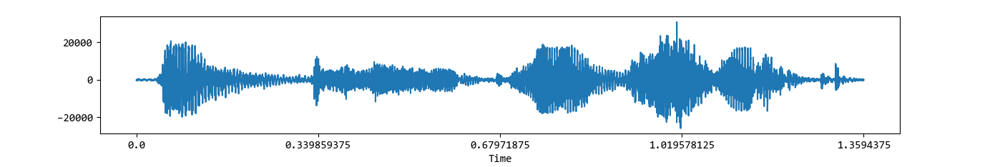
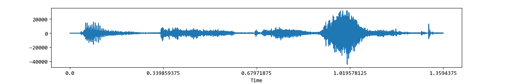
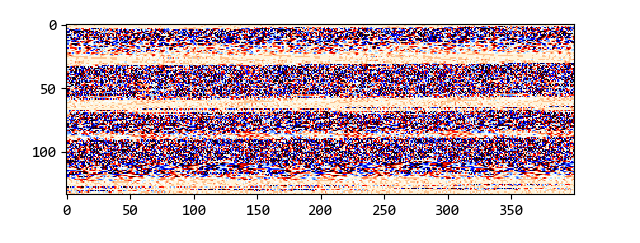
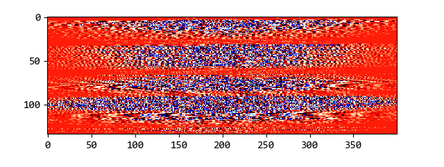
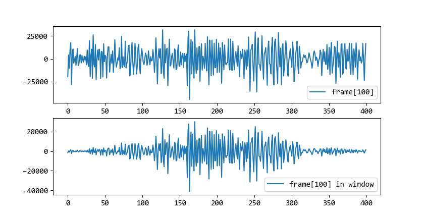
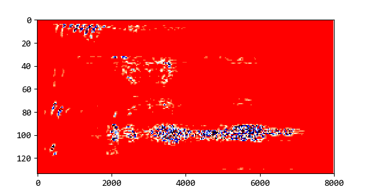
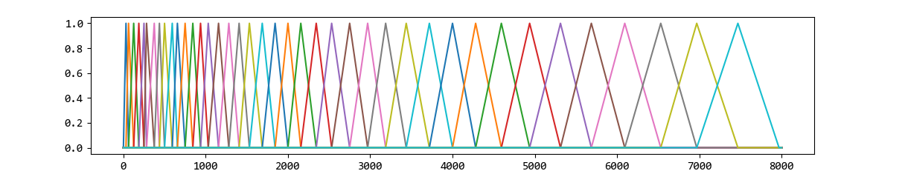
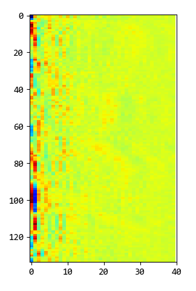
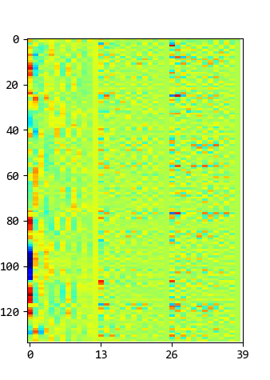

MFCC
====

梅尔频率倒谱系数(Mel Frequency Cepstrum Coefficient)常用于语音信号特征提取。
MFCC是一个特征矢量，用于表示一帧（如25ms）语音的信息。
理想情况下，最好是根据每帧的MFCC特征就可以映射到对应的音素。

:计算:

- 读取语音序列

- 预加重

  对语音序列进行高通滤波，加重高频段能量。

- 分帧

  每帧时间为25ms，在16KHz下就是400个数据点。分帧后的语音数据是一个(NUM x 400，NUM为帧数，这里为130+)的二维数组。

- 加窗

  使用汉明窗，使窗口边界的信号值收缩为零，保证连续性。

..

  下图是一帧数据加窗前后的对比。

- 短时傅里叶变换(STFT)

  STFT是对一个长信号分帧后，对每一帧进行傅里叶变换。
  这里使用STFT计算每一帧不同频带包含的能量。
  STFT的宽度为512，声音处理只用到正频段即可，故变换得到声谱的频域宽度为256，对应的频率范围为[0, 8KHz]。

- Mel滤波器

  人耳对高频部分不太敏感，将频率转成Mel频率，当对Mel频率等距处理时，则原频率在高频部分的间距就很大。

  Mel频率与原频率Hz的换算：

..  math::
    mel &=  2595 \times ln(1 + \frac{hz}{700}) \\
    hz &= 700 \times (e ^ {mel / 2595} - 1)
..

  因为Mel滤波器是用于对信号的频谱滤波，因而每个滤波器宽度与频域宽度相同，为256，对应的原频率范围为[0, 8KHz]。下图中Mel滤波器组共40个，每个滤波器收集来自给定频率范围内的能量。

- 倒谱

  倒谱，从定义上讲，就是声谱对数的声谱，即对能量声谱取对数后，再进行傅里叶变换。

  能量声谱经过Mel滤波器后，变成了(NUM x 40)的Mel声谱，进行倒谱计算后得到的倒谱如下图。

- MFCC特征

  一般每帧的40个倒谱值中，取前12个值作为MFCC特征。
  再加上每帧的能量，作为MFCC的第13个特征。能量计算公式如下（mffc.py实现中对能量取了对数）：

..  math::
    E = \sum_{t=t_1}^{t_2} x^2(t)
..

  再加上13个特征的 `Delta特征（一阶差分）` 和 `双Delta特征（二阶差分）` ，则MFCC特征向量共39个值。Delta最简单的计算方法就是微分，即计算帧之间的差值。

:参考:

- `speech-processing-for-machine-learning <https://haythamfayek.com/2016/04/21/speech-processing-for-machine-learning.html>`_
- `Speech and Language Processing <https://web.stanford.edu/~jurafsky/slp3>`_
